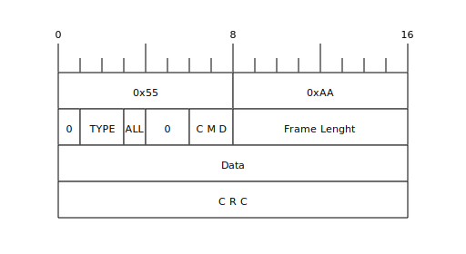
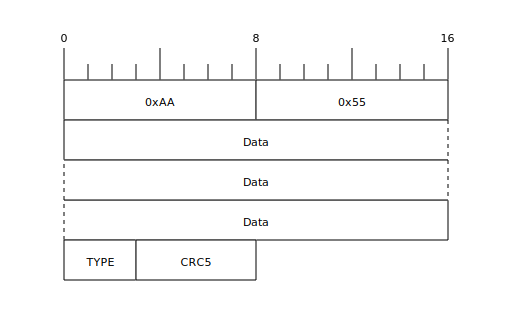
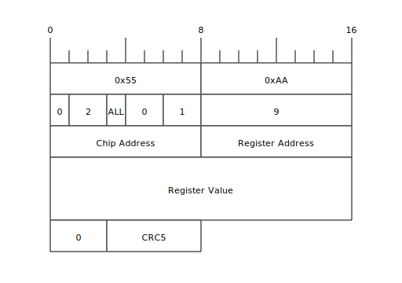
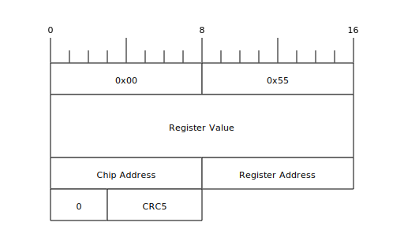
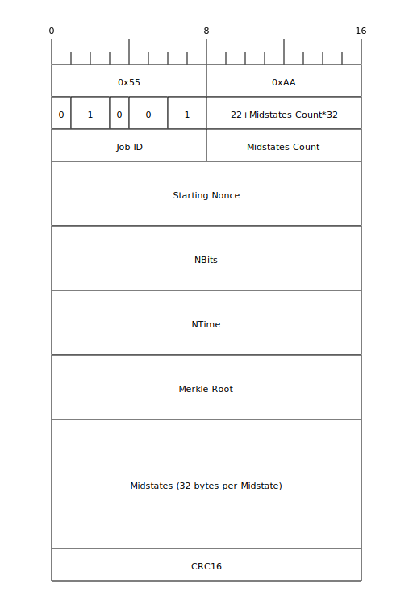

# Prelude

Many registers described below are common with other BM13xx chips. Here we focus mainly on BM1397 as this register map has been reverse engineered from the 'bmminer' of T17 original Firmware from Antminer.

# Full process step by step

1. Download the official T17 Firmware from [Antminer website](https://shop.bitmain.com/support/download).
2. Run these commands one by one:
```bash
tar -xvzf ANTMINER-T17-user-OM-202004231629-sig_5828.tar.gz
tar -xvzf fw.tar.gz
tail -c+65 < uramdisk.image.gz > uramdisk.image.cut.gz
gunzip -c -d uramdisk.image.cut.gz > uramdisk.image
mkdir uramdisk
sudo mount -ro loop uramdisk.image uramdisk
```
3. Mess with [Ghidra](https://ghidra-sre.org/) onto the bmminer ELF file.

## About x19 Firmware

The above methods will not work with x19 generation Firmware (for BM1398 chip) because they are packed in a BMU file format which is totally different.

First BMU files must be Unmerged using this [UnmergeTool](https://github.com/VladTheJunior/UnmergeTool).

Then how to extract the bmminer ELF file ???

# BM1397 Registers map

## Chip Address
Address = 0x00

Reset value = 0x13971800


## Hash Rate
Address = 0x04

Reset value = 0x80000000


## Phase Locked Loop (PLL0) Parameter
Address = 0x08

Reset value = 0xC0600161


## Chip Nonce Offset
Address = 0x0C

Reset value = 0x00000000


## Hash Counting Number
Address = 0x10

Reset value = 0x00000000


## Ticket Mask
Address = 0x14

Reset value = 0x00000000


## Misc Control
Address = 0x18

Reset value = 0x00003A01


### BT8D
It is a 9-bit divider to determine actual Baudrate. It is composed by BT8D_8_5 and BT8D_4_0.
### BCLK_SEL
<!-- cspell:disable-next-line -->
**B**audrate **CL**oc**K** **SEL**ect
* BCLK_SEL = 0: Baudrate base clock is CLKI (external clock)
* BCLK_SEL = 1: Baudrate base clock is PLL3
## Some Temp Related
Address = 0x1C

Reset value = 0x??


Reverse engineering on this register is still ongoing.
## Ordered Clock Enable
Address = 0x20

Reset value = 0x0000FFFF


## Fast UART Configuration
Address = 0x28

Reset value = 0x0600000F


## UART Relay
Address = 0x2C

Reset value = 0x000F0000


## Ticket Mask2
Address = 0x38

Reset value = 0x00000000


## Core Register Control
Address = 0x3C

Reset value = 0x??


Reverse engineering on this register is still ongoing.
### WR_RD#
* WR_RD# = 0: Read operation on Core Register. [CORE_REG_VAL](#core_reg_val) must be = 0xFF.
* WR_RD# = 1: Write operation on Core Register. [CORE_REG_VAL](#core_reg_val) must contain the value we want to write into the Core Register.
### CORE_REG_ID
Identifier of the Core Register.
### CORE_REG_VAL
Value of the Core Register with ID = [CORE_REG_ID](#core_reg_id)
## Core Register Value
Address = 0x40

Reset value = 0x??


Reverse engineering on this register is still ongoing.
## External Temperature Sensor Read
Address = 0x44

Reset value = 0x00000100


## Error Flag
Address = 0x48

Reset value = 0xFF000000


## Nonce Error Counter
Address = 0x4C

Reset value = 0x00000000


## Nonce Overflow Counter
Address = 0x50

Reset value = 0x00000000


## Analog Mux Control
Address = 0x54

Reset value = 0x00000000


## Io Driver Strength Configuration
Address = 0x58

Reset value = 0x02112111


## Time Out
Address = 0x5C

Reset value = 0x0000FFFF


## PLL1 Parameter
Address = 0x60

Reset value = 0x00640111


## PLL2 Parameter
Address = 0x64

Reset value = 0x00680111


## PLL3 Parameter
Address = 0x68

Reset value = 0x00700111


## Ordered Clock Monitor
Address = 0x6C

Reset value = 0x00000000


## PLL0 Divider
Address = 0x70

Reset value = 0x03040607


## PLL1 Divider
Address = 0x74

Reset value = 0x03040506


## PLL2 Divider
Address = 0x78

Reset value = 0x03040506


## PLL3 Divider
Address = 0x7C

Reset value = 0x03040506


## Clock Order Control0
Address = 0x80

Reset value = 0xD95C8410


## Clock Order Control1
Address = 0x84

Reset value = 0xFB73EA62


## Clock Order Status
Address = 0x8C

Reset value = 0x00000000


## Frequency Sweep Control1
Address = 0x90

Reset value = 0x00000070


## Golden Nonce For Sweep Return
Address = 0x94

Reset value = 0x00376400


## Returned Group Pattern Status
Address = 0x98

Reset value = 0x30303030


## Nonce Returned Timeout
Address = 0x9C

Reset value = 0x0000FFFF


## Returned Single Pattern Status
Address = 0xA0

Reset value = 0x00000000


# BM1397 Core Registers map

## Clock Delay Ctrl
ID = 0


## Process Monitor Ctrl
ID = 1


## Process Monitor Data
ID = 2


## Core Error
ID = 3


## Core Enable
ID = 4


## Hash Clock Control
ID = 5


## Hash Clock Counter
ID = 6


## Sweep Clock Control
ID = 7


# Protocol
<!-- cspell:disable-next-line -->
NRSTI (**N**egated **R**e**S**e**T** **I**nput) does a hardware reset on BM1397 when signal is Low.

<!-- cspell:disable-next-line -->
CLKI (**CL**oc**K** **I**nput) pin must have a 25MHz clock signal, it will be propagated to the CLKO (**CL**oc**K** **O**utput) pin.

<!-- cspell:disable-next-line -->
BI (**B**usy **I**nput) signal must be pulled-down in order to let the BM1397 communicate.

<!-- cspell:disable-next-line -->
Communication with BM1397 is done by UART on its CI (**C**command **I**nput) pin and RO (**R**esponse **O**utput). Default baudrate is 115200 bps. UART has 8 bits of data, no parity, 1 stop bit (usually represented as 115200 8N1).
## Command

### Preamble
All command have a fixed 2 bytes preamble: 0x55 0xAA
### TYPE
* TYPE = 1: send Job
* TYPE = 2: send Command
### ALL
* ALL = 0: send to a single Chip
* ALL = 1: send to all Chips on the Chain
### CMD
if TYPE == 1:
* CMD = 1: send Job

if TYPE == 2:
* CMD = 0: set Chip Address
* CMD = 1: write Register
* CMD = 2: read Register
* CMD = 3: chain Inactive
### Frame Length
Total Frame Length excluding preamble.
### Data
Depend on TYPE/CMD, see detailed frames below.
### CRC
Can be CRC5 or CRC16 depending on TYPE/CMD, see detailed frames below.
## Response


All Responses have fixed length : 9 bytes.
### Preamble
All commands have a fixed 2 byte preamble: 0xAA 0x55
### TYPE
* TYPE = 0: respond to a command
* TYPE = 4: respond to a job (nonce)
### Data
Depends on TYPE, see detailed frames below.
### CRC5
CRC 5 bits with polynomial 0x05, initial value 0x1F, no reflection, no final XOR of the full Frame excluding preamble.
## Set Chip Address
On reset, all chips have a logical address of 0. In order to access to a specific chip later, we must give them different addresses.

Warning : Chip Address are different to Chip index on the chain. It is a logical concept configurable by software.

To set Chip Address of all chips one by one, we must not send commands to ALL chips, just to the chip with Address = 0, so the first chip on the chain will get the command and not propagate it downward.

The Set Chip Address Command format is:


No Response is replied by the chip.
## Write Register
The Write Register Command format is:



No Response is replied by the chip.
## Read Register
The Read Register Command format is:


Sending a Read Register Command to ALL chips on the chain is very useful to enumerate them (usually with the [Chip Address](#chip-address) register), every chip on the chain will send a Response that will be propagated upward.
## Register Value
The Register Value Response format is:



Warning: sometime a Register Value can be sent spontaneously by a chip (usually the [Core Register Value](#core-register-value) register).
## Chain Inactive
The Chain Inactive Command format is:


No Response is returned by the chip.
## Send Job
The Send Job Command format is:


## Nonce
Once hashing, when a nonce is found by a chip on the chain, it is sent on the RO pin (and propagated upward) with this format:


## Write Core Register
In order to write values to a the Core Register, a [Write Register](#write-register) Command shall be done to the [Core Register Control](#core-register-control) Register with the [RD_WR#](#wr_rd) fields = 1.

## Read Core Register
In order to read the value of a Core Register, a [Write Register](#write-register) Command shall be done to the [Core Register Control](#core-register-control) Register with the [RD_WR#](#wr_rd) fields = 0.

Then the chip will reply a [Register Value](#register-value) Response for the [Core Register Value](#core-register-value) Register.

## Enumerate Chips on the Chain
With the original firmware of the control board, an enumeration of all chips on the chain (physically on a hash board) is done at the beginning. It is a [Read Register](#read-register) Command on [Chip Address](#chip-address) Register with [ALL](#all) = 1. Then all chips on the chain reply a [Register Value](#register-value) Response.

During this enumeration, we see that all chips on the chain have a [CHIP_ADDR](#chip-address) = 0. So the FW affects new Chip Address using the [Set Chip Address](#set-chip-address) Command, and sometimes also perform a [Write Register](#write-register) Command to [Chip Address](#chip-address) Register with the wanted [CHIP_ADDR](#chip-address) (seen on S9k original FW).

The [CHIP_ADDR](#chip-address) given don't have to be contiguous on a chain, for instance they are given with increments of 8 on T17 original FW (4 on S9k original FW).

## Set Baudrate
In order to get a higher hash rate, we need to increase the communication Baudrate because at 115200bps (default baudrate) a [Send Job](#send-job) Command with 4 midstate would take 15.2ms which could be longer than the time the full chain would take to Hash the complete Nonce space of the previous job.

BaudRate = fBase / ((BT8D + 1) * 8)

At chip reset, in [Misc Control](#misc-control) Register :
* [BCLK_SEL](#bclk_sel) = 0

fBase = fCLKI = 25MHz.

* [BT8D](#bt8d) = 26 (0x1A)

So the default BaudRate = fCLKI / ((BT8D + 1) * 8) = 115740 bps with reset values (0.47% error with target 115200 bps).

This is possible up to 3.125Mbps BaudRate with [BT8D](#bt8d) = 0.

For higher baud rates, here are the necessary steps (numeric example below is for 6.25 Mbps BaudRate):
1. enabling and configuring PLL3 using [PLL3 Parameter](#pll3-parameter) for example writing 0xC0700111 will result of a PLL3 with frequency equal to :

fPLL3 = fCLKI * FBDIV / (REFDIV * POSTDIV1 * POSTDIV2) = 25MHz * 112 / (1 * 1 * 1) = 2.8 GHz

2. setting [PLL3_DIV4](#pll3_div4) in [Fast UART Configuration](#fast-uart-configuration) for example writing 0x0600000F give a PLL3_DIV4 = 6
3. setting [BCLK_SEL](#bclk_sel) to 1

fBase = fPLL3 / (PLL3_DIV4 + 1) = 2.8 GHz / (6 + 1) = 400 MHz

4. setting [BT8D](#bt8d) to 7

BaudRate = fBase / ((BT8D + 1) * 8) = 400 MHz / ((7 + 1) * 8) = 6.25 MBps